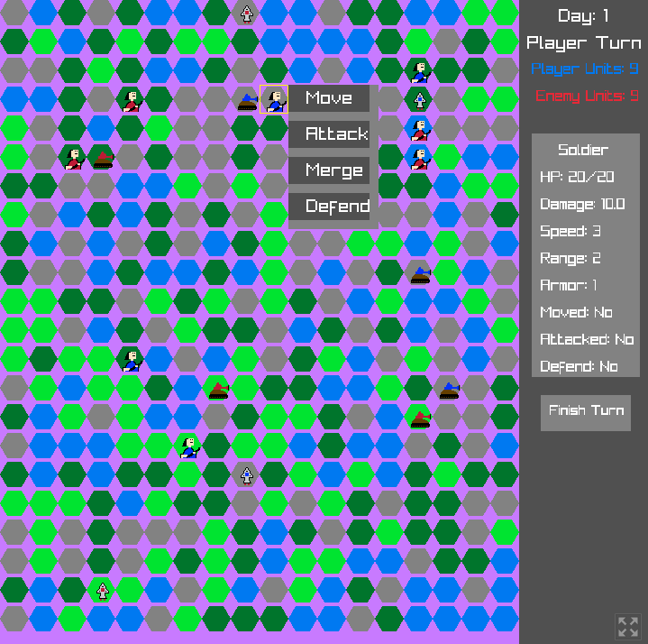
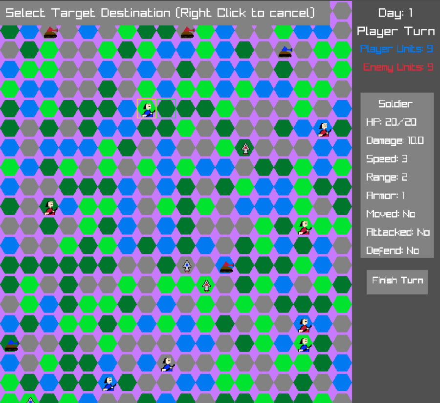
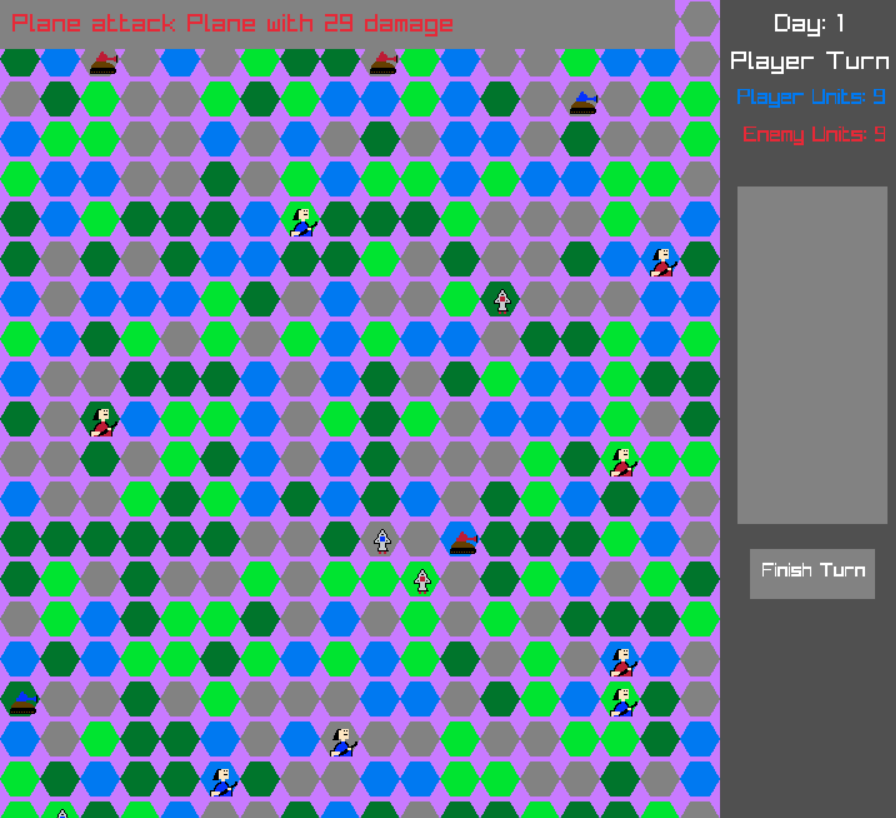

## Hex Wars

### Description

Hex Wars is a turn-based strategy game where players control armies on a hexagonal grid. The objective is to outmaneuver and defeat your opponents using strategic planning and tactical decisions.

### Features

 - Turn Based gameplay on a hexagonal grid.
 - Multiple units with unique properties.
 - Unique terrain types.
 - Merge Mode: Combine attacks for increased damage.
 - Defense mode: Fortify your units to withstand enemy attacks. 

### Controls

Mouse

 - Left Click: Select unit / Move unit / Attack.
 - Right Click: Cancel action / Deselect unit.

Mobile

 - Tap: Select unit / Move unit / Attack.
 - Double Tap: Cancel action / Deselect unit.

### Screenshots

### Developers

 - Zerasul (Make Classic Games) -  Game Design and Programming.
 - Emiliollbb - Programming, Art and Sound Design.

### Links

 - itch.io Release: [itch.io Game Page](https://zerasul.itch.io/hex-wars).

### License

This project sources are licensed under GPL v3.0 License.
Check [LICENSE](LICENSE) for further details.

Raylib is licensed under zlib/libpng License. Check [Raylib License](https://www.raylib.com/license.html) for further details.

*Copyright (c) 2026 Zerasul(Make Classic Games) and Emiliollbb.*
